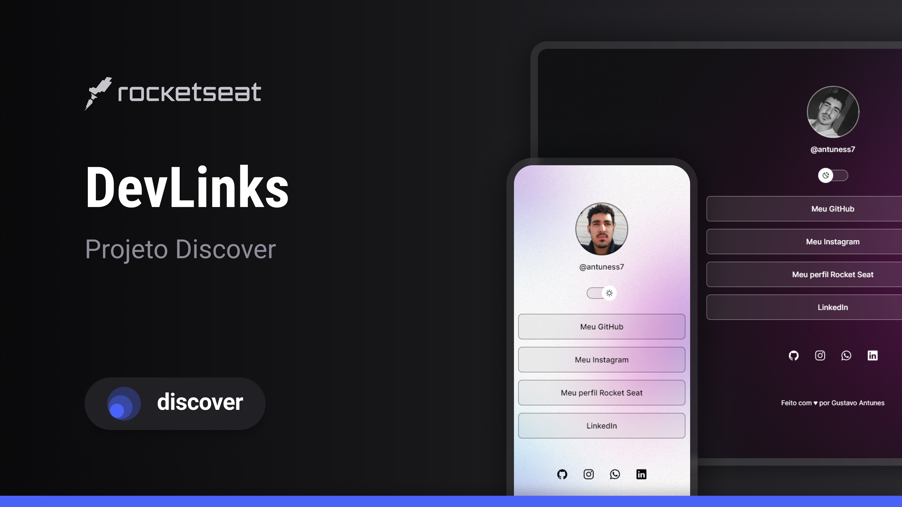

<h1 align="center"> DevLinks </h1>

Projeto desenvolvido durante o curso gratuito, promovido pela Rocketseat para ensino de tecnologias web.

  <a href="#-tecnologias">Tecnologias</a>&nbsp;&nbsp;&nbsp;|&nbsp;&nbsp;&nbsp;
  <a href="#-projeto">Projeto</a>&nbsp;&nbsp;&nbsp;|&nbsp;&nbsp;&nbsp;
  <a href="#-layout">Layout</a>&nbsp;&nbsp;&nbsp;|&nbsp;&nbsp;&nbsp;
  <a href="#memo-licença">Licença</a>

  

 

  

## ??Tecnologias

Esse projeto foi desenvolvido com as seguintes tecnologias:

- HTML e CSS
- JavaScript
- Git e Github
- Figma

## ?? Projeto

O DevLinks é um projeto de uma página web onde contém as redes sociais e o portfólio do desenvolvedor.

## ?? Layout

Você pode visualizar o layout do projeto através [DESSE LINK](<https://www.figma.com/file/tI5ECs6wCucqfXYL0VhjHU/DevLinks-%E2%80%A2-Projeto-Discover-(Community)?type=design&node-id=10-620&mode=design&t=DfbNjPkhRQQIFA9C-0>). É necessário ter conta no [Figma](https://figma.com) para acessá-lo.

## ?? Licença

Esse projeto está sob a licença MIT.

---

Feito com ?? by Rocketseat ?? [Participe da nossa comunidade!](https://discord.gg/rocketseat)
